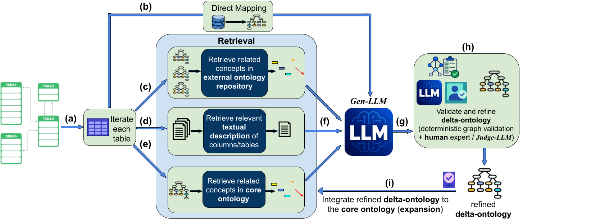

# RIGOR: Retrieval-Augmented Iterative Generation of Ontologies with Refinement

An end-to-end framework for automatically generating semantically rich OWL 2 ontologies from relational database schemas. RIGOR combines deterministic direct mapping with LLM-driven semantic enrichment, RAG-based context retrieval, and a Judge-LLM validation loop to produce ontologies that go beyond simple schema translation.

<!-- TODO: Add pipeline figure here -->
<!--  -->

---

## Overview

Translating relational databases into ontologies is a well-studied problem, but existing approaches either produce shallow structural mirrors of the schema (direct mapping) or rely on unconstrained LLMs that hallucinate concepts. RIGOR bridges this gap through a multi-stage pipeline:

1. **Deterministic Direct Mapping** generates a faithful OWL backbone from the SQL schema, guaranteeing full structural coverage.
2. **FK-Guided Iterative Enrichment** processes tables in foreign-key dependency order. For each table, a Gen-LLM produces semantic enrichment deltas (labels, comments, subclass axioms, restrictions, provenance links) grounded in three RAG sources: the growing core ontology, domain documents, and external reference ontologies.
3. **Judge-LLM Validation** reviews each delta for consistency with the schema and the direct mapping before it is merged, rejecting or correcting hallucinated constructs.


The repository also includes baseline and ablation scripts for reproducible evaluation, a competency-question generator, a full evaluation suite, and a knowledge-graph population module.

---

## Repository Structure

```
RIGOR_Framework/
│
├── app.py                      # Core RIGOR pipeline (iterative enrichment + Judge-LLM)
├── mapping.py                  # Deterministic direct mapping (SQL schema → OWL Manchester Syntax)
├── baseline.py                 # Baseline: schema-only LLM generation (no RAG, no Judge)
├── non-iterative.py            # Ablation: single-pass LLM with RAG but no iteration/Judge
├── cqs.py                      # Competency question generator (per-table CQs via LLM)
├── eval.py                     # Multi-dimensional evaluation suite (CQ scoring, structural, coverage)
├── ablation_evaluation.py      # Ablation study evaluator (schema/ontology/document reference matching)
├── ontology_checker.py         # HermiT consistency + OOPS! pitfall checker
├── sql_to_kg.py                # Knowledge graph population from SQL data dumps / CSVs
├── run_all.py                  # Batch runner: all LLMs × all schemas
├── run_ablation.py             # Batch runner: ablation variants for a schema
│
├── sql_schema/                 # Database schema JSON files
│   ├── schema_chinook.json
│   ├── schema_rd.json
│   └── schema_icu.json
│
├── core_ontology/              # Seed core ontologies (bootstraps the growing core)
│   ├── core.owl
│   └── core_icu.owl
│
├── documents_chinook/          # Domain documents for RAG retrieval (Chinook)
├── external_ontologies_chinook/# Reference ontologies for RAG retrieval (Chinook)
│
├── output/                     # Generated ontologies (created at runtime)
│   ├── RIGOR/<schema>/<model>/enriched_ontology.owl
│   ├── baseline/<schema>/<model>/baseline_ontology.owl
│   ├── non_iterative/<schema>/<model>/non_iterative_ontology.owl
│   └── direct_mapping/
│
├── cqs/                        # Generated competency questions (created by cqs.py)
├── evaluation/                 # Evaluation results (created by eval.py)
└── jars/                       # External JARs (HermiT reasoner)
```

---

## Setup

### Prerequisites

- Python 3.10+
- Java (on PATH) — required only for `ontology_checker.py` (HermiT reasoner)
- An [OpenRouter](https://openrouter.ai/) API key for LLM access

### Installation

```bash
git clone https://github.com/<your-org>/RIGOR_Framework.git
cd RIGOR_Framework

pip install -r requirements.txt
```

**Key dependencies:**

```
rdflib
sentence-transformers
numpy
openai
requests
chardet
faiss-cpu
matplotlib
seaborn
pandas
owlready2
python-docx
thefuzz          
```

### Environment Variables

```bash
export OPENROUTER_API_KEY="your_key_here"
```

### Configuration

All scripts use a `BASE_PATH` variable at the top of the file that points to the repository root. By default, it is set to the script's current directory. Update it if your layout differs.

---

## Usage

### 1. Generate the Direct Mapping

Produces a deterministic OWL ontology from the schema alone (no LLM calls), following the direct mapping approach of [Sequeda et al. (2012)](#references):

```bash
python mapping.py
```

Edit `INPUT_JSON` and `OUTPUT_FILE` at the top of `mapping.py` to point at your schema.

### 2. Run the Full RIGOR Pipeline

Runs iterative RAG-augmented enrichment with Gen-LLM + Judge-LLM:

```bash
python app.py
```

Or for all LLM × schema combinations:

```bash
python run_all.py
```

**What happens during a run:**
1. Schema is loaded and parsed from JSON
2. Local embedding model (`all-MiniLM-L6-v2`) is initialized
3. FAISS indices are built for domain documents and external ontologies
4. Seed core ontology is loaded (if provided)
5. Tables are traversed in FK-dependency order
6. For each table: direct mapping is merged → RAG context is retrieved → Gen-LLM produces a delta → Judge-LLM validates → deterministic post-validation → merge into growing core
7. Final ontology is validated and serialized as OWL/XML

### 3. Run Baselines

**Schema-only baseline** — LLM generates ontology fragments from schema alone, with no RAG, no documents, and no Judge, following the approach of [Mateiu and Groza (2023)](#references):

```bash
python baseline.py
```

**Non-iterative baseline** (single-pass with RAG, no iteration, no Judge):

```bash
python non-iterative.py
```

### 4. Run the Ablation Study

Generates ontology variants with selected context sources disabled:

```bash
python run_ablation.py                          # all variants
python run_ablation.py --variant no_rag         # single variant
```

Ablation variants:

| Variant | Schema Context | External Ontologies | Documents |
|---------|:-:|:-:|:-:|
| `no_rag` | — | — | — |
| `only_schema_context` | ✓ | — | — |
| `only_external_ontologies` | — | ✓ | — |
| `only_relevant_documents` | — | — | ✓ |
| `without_schema_context` | — | ✓ | ✓ |
| `without_external_ontologies` | ✓ | — | ✓ |
| `without_relevant_documents` | ✓ | ✓ | — |

The deterministic direct mapping is always retained in every variant to keep schema coverage constant, isolating only the contribution of contextual inputs.

### 5. Generate Competency Questions

Generates 5 CQs per table using an LLM, saved in the format expected by `eval.py`:

```bash
python cqs.py
```

### 6. Evaluate Ontologies

Runs multi-dimensional evaluation across all generated ontologies:

```bash
python eval.py
```

Evaluation dimensions:
- **CQ-based quality scoring** — 6 dimensions scored by a Judge-LLM (GPT-4o, a different model family from all generators to avoid self-evaluation bias)
- **Structural analysis** — class/property/axiom counts
- **Semantic coverage** — how well schema concepts are covered (embedding similarity)
- **Syntax and logical consistency** — rdflib parse validation

### 7. Consistency and Pitfall Checking

Runs HermiT (logical consistency) and OOPS! (ontology pitfall detection) on all ontologies:

```bash
python ontology_checker.py
```

Requires `HermiT.jar` — download from [owlcs/HermiT releases](https://github.com/owlcs/HermiT/releases) and place in `jars/`.

### 8. Evaluate Ablation Results

```bash
python ablation_evaluation.py
```

Evaluates all ablation variants against three reference sources (schema terms, external ontology concepts, documentation corpus) using both exact lexical matching and semantic similarity.

### 9. Populate a Knowledge Graph with Real Data

Reads SQL dumps or CSVs and instantiates individuals in the RIGOR-enriched ontologies:

```bash
python sql_to_kg.py
```

---

## LLMs Used

All LLM calls go through [OpenRouter](https://openrouter.ai/). The three generator LLMs and the judge LLM are:

| Role | Model | OpenRouter ID |
|------|-------|---------------|
| Generator | Claude (Anthropic) | `anthropic/claude-opus-4-6` |
| Generator | Mistral Small 24B | `mistralai/mistral-small-24b-instruct-2501` |
| Generator | DeepSeek Chat | `deepseek/deepseek-chat` |
| Judge (eval) | GPT-4o | `openai/gpt-4o-2024-11-20` |

The Judge-LLM in `eval.py` is intentionally from a different model family than all three generators to eliminate self-evaluation bias.

---

## Database Schemas

The framework has been evaluated on three database schemas:

| Schema | Domain | Description |
|--------|--------|-------------|
| `chinook` | Music | The Chinook sample database (artists, albums, tracks, invoices) |
| `real_world` | Clinical | Real-world liver cancer patient registry |
| `eicu_crd` | Clinical | eICU Collaborative Research Database |

Schema files are provided as JSON in `sql_schema/`. Each file maps table names to their columns and (optionally) foreign key definitions.

---

## Output Format

All generated ontologies are serialized as **OWL/XML** (`.owl` files) and can be opened in Protégé or any OWL-compatible tool. Key ontology features include:

- OWL 2 classes, datatype properties, and object properties with full domain/range declarations
- `rdfs:label` and `rdfs:comment` annotations
- `owl:hasKey` assertions for primary keys
- Existential (`some`) and universal (`only`) restrictions on object properties
- PROV-O provenance metadata (`prov:generatedAtTime`, `prov:wasDerivedFrom`)
- SKOS alignment links to external ontologies (`skos:exactMatch`, `skos:closeMatch`)

---

## References

This work builds on the following prior work:

- **Direct Mapping:** Sequeda, J.F., Arenas, M., Miranker, D.P.: On directly mapping relational databases to RDF and OWL. In: Proceedings of the 21st International Conference on World Wide Web, pp. 649–658 (2012)
- **LLM-based Ontology Engineering Baseline:** Mateiu, P., Groza, A.: Ontology engineering with large language models. In: 2023 25th International Symposium on Symbolic and Numeric Algorithms for Scientific Computing (SYNASC), pp. 226–229. IEEE (2023)

---
